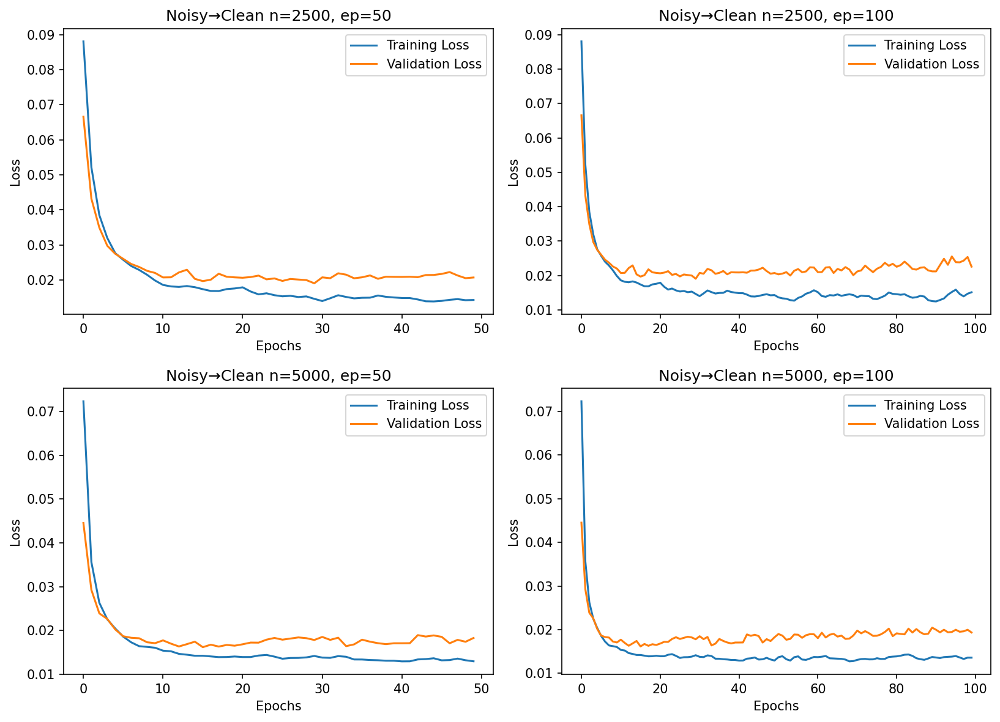

# ---- folders ----
FIG_DIR, TAB_DIR = "figures", "tables"
for d in (FIG_DIR, TAB_DIR):
    shutil.rmtree(d, ignore_errors=True)
    os.makedirs(d)

# ---- figures: loss curves, digits, confusion matrices ----
plot_loss(results, "Noisy→Clean", save=f"{FIG_DIR}/loss.png", show=False)
for (n, ep) in results:
    show_digits(results, (n, ep), save=f"{FIG_DIR}/digits_n{n}_ep{ep}.png", show=False)
    show_confusion(results, (n, ep), save=f"{FIG_DIR}/confusion_n{n}_ep{ep}.png", show=False)

# ---- table ----
table = make_table(results)
table["train_time_s"] = [round(r["time"], 1) for r in results.values()]
table.to_csv(f"{TAB_DIR}/results.csv", index=False)

def md_table(df):
    cols = list(df.columns)
    out = ["| " + " | ".join(cols) + " |", "| " + " | ".join("---" for _ in cols) + " |"]
    for r in df.itertuples(index=False):          # itertuples keeps ints as ints (iterrows turns them into floats)
        out.append("| " + " | ".join(str(v) for v in r) + " |")
    return "\n".join(out)

with open(f"{TAB_DIR}/results.md", "w") as f:
    f.write(md_table(table) + "\n")

# ---- README.md (numbers come straight from the run above) ----
cfg = json.load(open(f"{LOG_DIR}/config.json"))
summ = []
next(iter(results.values()))["model"].summary(print_fn=lambda s, **k: summ.append(s))

best = table.loc[table["MSE denoised"].idxmin()]
beats = best["MSE denoised"] < best["MSE noisy"]

fig_lines = "\n".join(
    f"- size {n}, {ep} epochs: [digits](figures/digits_n{n}_ep{ep}.png), "
    f"[confusion matrices](figures/confusion_n{n}_ep{ep}.png)" for (n, ep) in results)

file_rows = [
    ("`*.ipynb`", "the notebook with all code"),
    ("`logs/epoch_log.csv`", "per-epoch loss, validation loss, learning rate and time for every run"),
    ("`logs/results_summary.csv`", "final metrics and training time per run"),
    ("`logs/config.json`", "seed, split, noise, learning rate, runtime and library versions"),
]
if os.path.isdir(f"{LOG_DIR}/runs"):
    file_rows.append(("`logs/runs/*.csv`", "the epoch log split into one file per run"))
file_rows += [
    ("`tables/results.csv`, `tables/results.md`", "the results table"),
    ("`figures/`", "loss curves, digit examples and confusion matrices"),
]
files_md = "\n".join(f"| {a} | {b} |" for a, b in file_rows)

readme = f"""# {cfg['model']}: MNIST image denoising

The model takes a noisy MNIST image and outputs a new image that should match the original. It is trained on pixels only: the target is the clean original image and the loss is mean squared pixel error. This is a denoising / reconstruction task, not classification or prediction. Digit labels are used only to split the data evenly and for the optional accuracy check described under Metrics.

## Setup

| item | value |
| --- | --- |
| data | MNIST, all 70,000 images, stratified subsets of {cfg.get('sizes')} images |
| split | 70% train / 10% validation / 20% test (stratified) |
| noise | Gaussian, sigma = {cfg.get('noise_level')}, clipped to [0, 1]. Added to the input images of train, validation and test (different random noise per split). The targets are always the clean originals. |
| epochs | {cfg.get('epochs')} |
| optimizer | Adam, learning rate {cfg.get('lr')}, batch size {cfg.get('batch_size')} |
| seed | {cfg.get('seed')} (same for every run) |
| runtime | {cfg.get('device')}, TensorFlow {cfg.get('tf_version')}, Python {cfg.get('python')} |

## Model

```
{chr(10).join(summ).strip()}
```

## Results

`noisy` columns are the baseline (the noisy test image compared with the clean original). `denoised` columns are the model output compared with the clean original. The model only helps where `denoised` beats `noisy`. MSE: lower is better. PSNR, SSIM, Acc: higher is better.

{md_table(table)}

Lowest denoised MSE: size {int(best['size'])}, {int(best['epochs'])} epochs, MSE {best['MSE denoised']} against a noisy baseline of {best['MSE noisy']} ({'beats' if beats else 'does not beat'} the baseline on MSE).

## Figures



{fig_lines}

## Files

| path | content |
| --- | --- |
{files_md}

## Metrics

- **MSE**: mean squared pixel error against the clean original.
- **PSNR**: peak signal-to-noise ratio in dB, averaged per image.
- **SSIM**: structural similarity, averaged per image.
- **Acc** and the confusion matrices (secondary check): a small dense classifier (784-128-10) trained on clean images is applied to the original, noisy and denoised test images. It shows whether a denoised digit is still read as the right digit. The classifier is not part of the denoiser.

## Reproduce

Open the notebook in Google Colab and run all cells in order. The first logging cell clears `logs/`, so run the whole notebook from the top.
"""
with open("README.md", "w") as f:
    f.write(readme)

print(sorted(os.listdir(FIG_DIR)))
print(os.listdir(TAB_DIR), "| README.md written")
